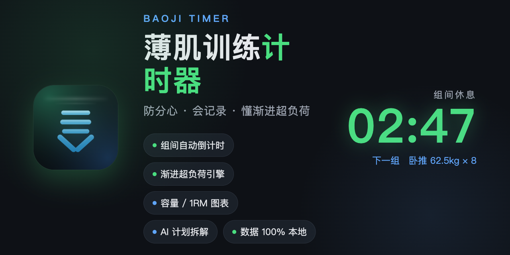
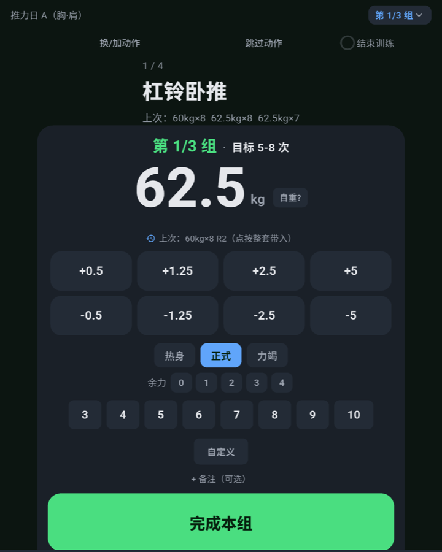
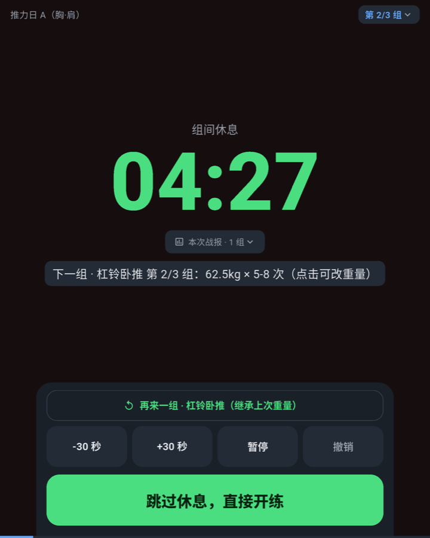
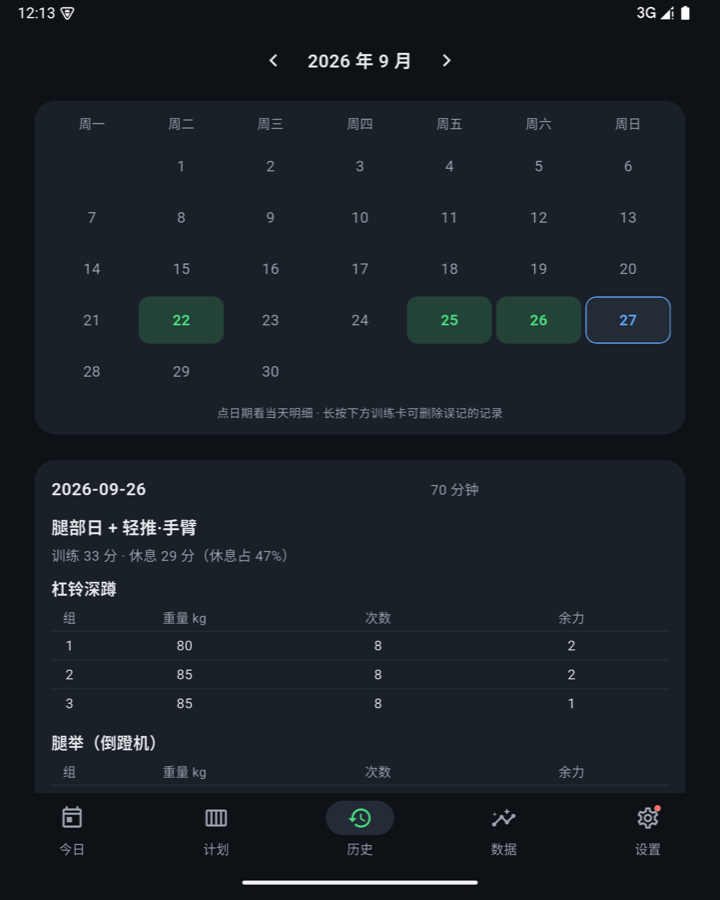
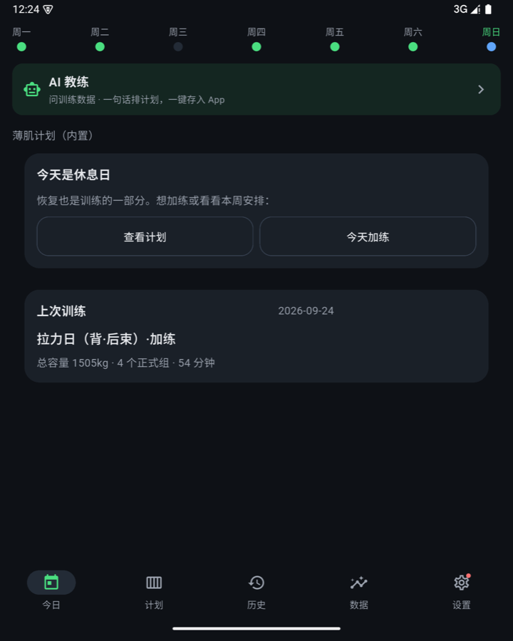
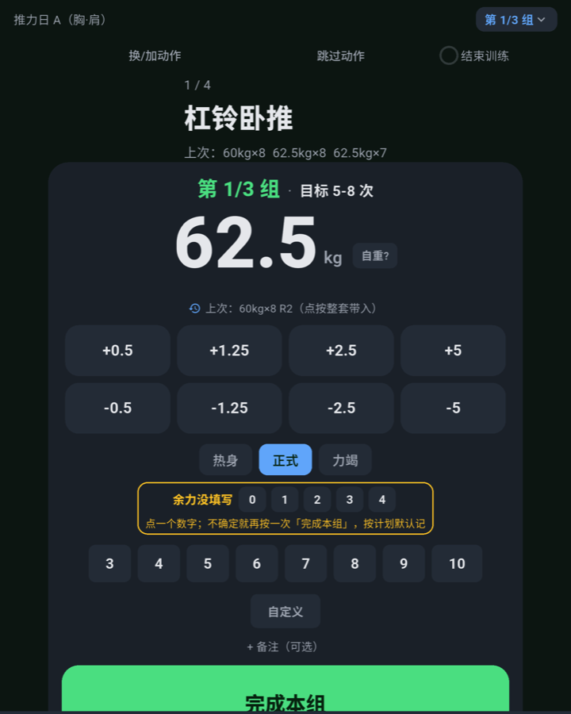
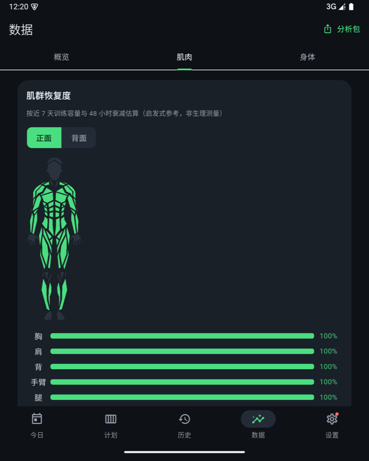

<div align="center">


# Baoji Timer (薄肌训练计时器)

**A distraction-free strength training log, built around the "Baoji" lean-muscle plan**

[简体中文](README.md) | **English**

[](https://github.com/kelinpan0524-cell/baoji-timer/releases)
[](https://github.com/kelinpan0524-cell/baoji-timer/releases)
[](https://flutter.dev)
[](#-privacy-by-design)
[](LICENSE)



Inspired by the "Baoji" (lean-muscle) philosophy of [@AlanShao111](https://x.com/AlanShao111) —
as his junior schoolmate, I turned the Baoji plan into an open-source app you can train with right away. 🏋️

</div>

---

## Why I Built This

Lean muscle comes down to low body fat, three sessions a week, and progressive overload. Harder than the training itself is **logging consistently and staying focused between sets**. Most fitness apps bury you in pop-up ads and social noise, so I wrote my own: during a workout you see only the current exercise, the target for this set, and the countdown — everything else stays out of the way.

## Screens at a Glance

<p align="center">
  
  
  
</p>
<p align="center">
  
  
  
</p>

## ✨ Features

### 🏋️ During the Workout: Focus First
- Full-screen big-button set logging: weight stepping (±0.5 / 1.25 / 2.5 / 5 kg, keyboard optional), tap-to-pick reps, RIR, warm-up / working / failure tags; for high-rep sets (12/15+) tap "Custom" and type any rep count
- Automatic rest countdown (180s compound / 120s assistance, adjustable) that keeps ticking on the lock screen or in the background, with notification-bar + exact-alarm reminders
- Last-time comparison and automatic PR detection; Do-Not-Disturb during workouts and a nudge when you wander off into other apps
- Set completion: vibration + visual confirmation, no need to read the screen
- Plate math for barbell lifts: changing the weight briefly shows the per-side plate breakdown, then tucks itself away
- Forgot to stop the timer? Before saving a suspiciously long session it asks once and can trim the log back to your last set

### ⏰ Show-Up Reminders
- Training-day reminder: if a scheduled training day comes and you have not trained by the time you set, a local notification gives you a gentle nudge (works even without Feishu)
- Four-layer rest cue sounds with a "headphones only" mode — cues go into your earphones while you listen to music, and stay silent when none are connected

### 📈 Progressive Overload Engine
- The Baoji plan is built in — big-four lifts, three sessions a week, ready to run
- Automatic load recommendations: all working sets hitting the rep ceiling with gas left in the tank → add weight; any set below the floor → cut ~5%
- Automatic 1RM estimation, volume and intensity trends at a glance

### 🤖 AI Features (Bring Your Own Key, Data Stays Yours)
- Paste an existing plan → AI converts it verbatim into a structured plan
- Or one plain sentence ("train four days a week, back/chest/legs, muscle growth") → a complete plan
- **Conversational planning** (AI Coach): chat your requirements, adjust anytime (swap exercises, change reps, add/remove days) — every reply carries the full plan; preview and save only after you review it exercise by exercise
- Exercise-by-exercise review before anything is saved; works with any OpenAI-compatible endpoint, including LAN-hosted Ollama
- **AI Coach** (from the Stats page): automatically attaches your last 8 weeks of real training data for one-tap phase reviews or free-form Q&A; built-in coach persona with safety boundaries (no fabricated numbers, no injury diagnosis); failures state the cause and can be retried — local rules never masquerade as AI
- One-tap "Test Connection" in Settings tells you immediately whether it works

### 📊 Analytics
- Training calendar, weekly volume trends, big-four 1RM curves
- Front/back muscle-group volume heatmap
- Body weight / waist / body-fat tracking
- Full CSV / JSON export; one-tap "AI analysis pack" to feed any AI for a training review

### 📅 Feishu Calendar Sync
Training days are written to your Feishu/Lark calendar automatically (with a reminder), summaries are written back after the session, and offline writes are queued. Setup: [docs/feishu-calendar.md](docs/feishu-calendar.md).

### 🌐 Language
- Chinese and English in-app, switchable any time under **Settings → Language / 语言** (follow-system by default)

## 📥 Install

1. Grab the latest APK from [Releases](https://github.com/kelinpan0524-cell/baoji-timer/releases) (Android 8.0+)
2. Install and go: the Baoji plan is built in — no sign-up, no login, no permissions
3. For in-app one-tap updates, see [docs/update-setup.md](docs/update-setup.md) (one-time permission, no token needed for the public repo)

## 🍎 iPhone Users & DIY Builders

Official builds are Android-only. To compile it yourself, maintain a fork, or port it to iOS on your Mac, read [AI-BUILD-GUIDE.md](AI-BUILD-GUIDE.md) — an operations manual written for AI coding assistants. Hand it to your AI (ZCode / Claude Code / Cursor all work) together with the repo and say "do it per the guide".

## 🔒 Privacy by Design

- **No server**: everything runs on your phone; training data lives in local SQLite
- **Only three network touchpoints**: Feishu calendar read/write (your phone talks to the official API directly), AI features (plan parsing + AI coach chat/analysis, your own API key, straight to the provider you choose), and update checks (GitHub Releases)
- AI keys / Feishu credentials stay on-device — never uploaded, never committed
- No ads, no analytics SDK, no crash reporting

## 🛠️ Development

```bash
flutter pub get
flutter analyze      # 0 issues
flutter test         # unit tests (progression engine, timing logic)
flutter build apk --release
# output: build/app/outputs/flutter-apk/app-release.apk
```

Requirements: Flutter 3.35+ / JDK 17 / Android SDK 35 / minSdk 26.

- Workout state machine is decoupled from UI (global SessionController + wall-clock timing); folding/unfolding never loses state; <600dp single column, ≥840dp two columns
- `scripts/mock_ai_server.py`: local mock AI server for end-to-end AI pipeline testing without a real key
- Merges to main automatically build a signed APK and publish a Release (tag = `b<build number>`, the build number is the versionCode)
- Directory layout in [AGENTS.md](AGENTS.md), design spec in [docs/design-spec.md](docs/design-spec.md)

## 🙏 Acknowledgements

- **Alan Shao (邵艾伦)** — the Baoji theory and the direct inspiration for this project
- Body muscle heatmap SVG path data from [vulovix/body-muscles](https://github.com/vulovix/body-muscles) (Apache License 2.0), re-colored in this project by training intensity

## 📄 License

[MIT](LICENSE) © 2026 kelinpan (Arono)

Portions of the muscle heatmap SVG path data are licensed under the [Apache License 2.0](https://www.apache.org/licenses/LICENSE-2.0).
